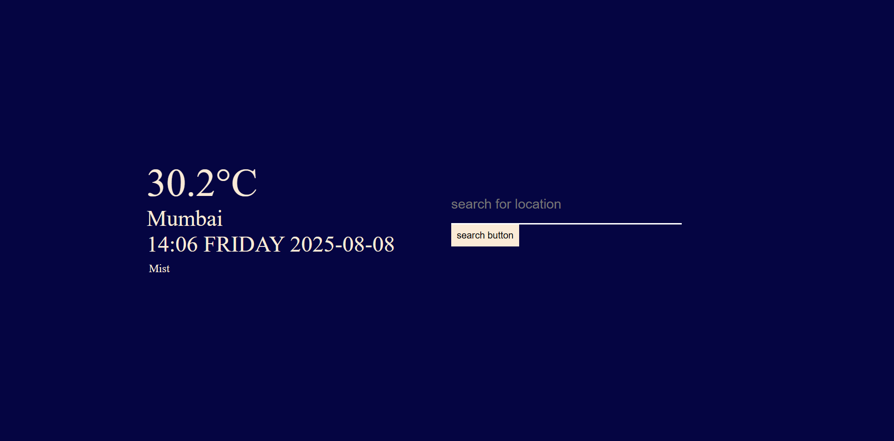

# 🌦 Weather App

A simple weather application that fetches real-time weather data for any city using the [WeatherAPI](https://www.weatherapi.com/) service.

## 🚀 Live Demo  
[Click here to view the demo](https://sweet-otter-562d7e.netlify.app)  

**GitHub Repository:** [Bhavanapriya23/weather-repo](https://github.com/Bhavanapriya23/weather-repo)

## 📂 Files in This Repository  
- **index.html** – Main HTML structure  
- **style.css** – Styling for the app  
- **script.js** – JavaScript logic for fetching and displaying weather data  
- **README.md** – Documentation for the project  
- **screenshot.png** – App preview image  

## ⚡ How It Works
1. Enter a city name in the search box.  
2. App fetches live weather data from WeatherAPI.  
3. Displays temperature, condition, and location.

## 🛠 Technologies Used
- HTML5  
- CSS3  
- JavaScript (Fetch API)  
- WeatherAPI  

---

**Note:** API key is not included in this public repository for security reasons.
